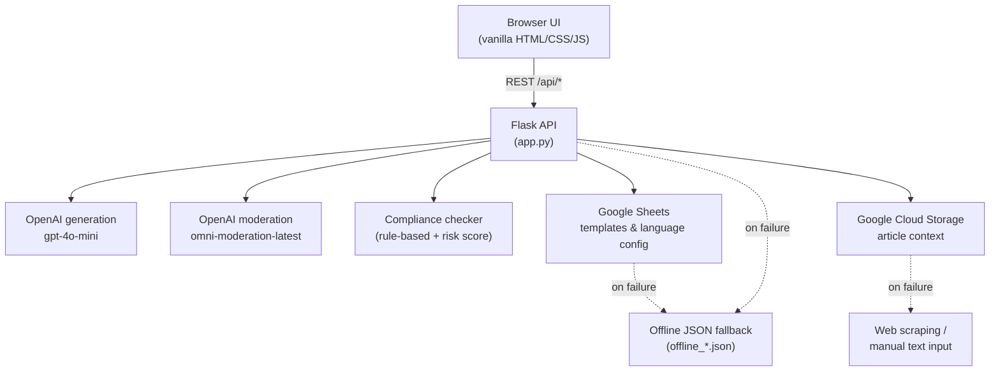

# AI Ad Copy Compliance Generator

> Generate platform-specific, compliance-checked ad copy in 6+ languages (including RTL) with `gpt-4o-mini` and OpenAI moderation — with graceful offline fallback.

   

## Overview

Paid-advertising teams face a recurring problem: every platform (Facebook, Google Ads, Instagram, LinkedIn, X) and every market enforces its own rules about what an ad may say. Words like *"guaranteed"*, *"free"*, *"best"*, or *"#1"* routinely trigger ad disapprovals, and the risk multiplies once you advertise across languages and jurisdictions — EU and German advertising law in particular treat absolute and superlative claims strictly.

This project is a Flask web app that generates ad copy **and** screens it for compliance in a single pass. It uses OpenAI's `gpt-4o-mini` to produce platform-appropriate variants, runs every variant through the `omni-moderation-latest` moderation endpoint, then applies a rule-based compliance checker that flags high-risk regulatory terms, scores the overall risk, and suggests safer alternatives. Templates and per-market language configuration are pulled live from Google Sheets, article context can be sourced from Google Cloud Storage, and the whole stack falls back to bundled offline JSON when external services are unavailable.

I built this to demonstrate practical Gen AI engineering: prompt design, multilingual output control, structured-output parsing, content moderation, and a regulatory-compliance layer relevant to real advertising operations.

## Key Features

- **Multi-language generation, including RTL languages** — English, Hebrew, Arabic, Russian, Spanish, French and more, each with dedicated localized prompts (not literal translation), so CTAs and phrasing read naturally per market.
- **Regulatory compliance flagging** — a rule-based checker scans every text field for high-risk terms (e.g. *guaranteed*, *free*, *best*, *#1*, *always*, *never*) across English and Hebrew term lists, plus platform-specific phrases (e.g. *"click here"*, *"swipe up"*).
- **Risk scoring & safer rewrites** — flagged terms accumulate a weighted 0–100 risk score, and the app suggests compliant alternatives (e.g. *free → limited-time offer*, *best → leading*).
- **OpenAI content moderation** — each variant is additionally screened through `omni-moderation-latest` for hate, harassment, violence, sexual and self-harm categories.
- **Platform-specific variants** — copy is generated and checked for Facebook, Google Ads, Instagram, LinkedIn and X, respecting per-platform length and style conventions.
- **Geo-aware configuration** — language-by-market mappings drive which languages are offered per country and feed localization notes into the prompt.
- **Sheets-driven templates & config** — headline templates and country/language tables are loaded from Google Sheets via a service account, so non-developers can update them without code changes.
- **Article context from GCS** — article bodies can be retrieved from a Google Cloud Storage bucket (with URL-pattern matching and versioned-file resolution) to ground headline generation in real content.
- **Graceful offline fallback** — if Google Sheets, GCS, or external scraping are unavailable, the app falls back to bundled `offline_languages.json` and `offline_templates.json` so it keeps working without any cloud dependency.
- **Export-ready output** — the UI supports copy, JSON, and CSV export of generated headlines.

## Architecture



The browser talks only to the Flask API; all credentials stay server-side. Generation, moderation, and compliance run per variant, and every external dependency has a documented fallback path.

## Tech Stack

| Layer | Technology |
| --- | --- |
| Language | Python 3 |
| Web framework | Flask |
| Generation model | OpenAI `gpt-4o-mini` |
| Moderation model | OpenAI `omni-moderation-latest` |
| Google Sheets | `gspread` + `google-auth` |
| Object storage | Google Cloud Storage (`google-cloud-storage`) |
| Content extraction | BeautifulSoup4, `requests` |
| Language detection | `langdetect` |
| Data handling | pandas, openpyxl |
| Frontend | Vanilla HTML / CSS / JavaScript (`static/`) |
| Config | `python-dotenv` |

## Getting Started

### Prerequisites

- Python 3.10+
- An OpenAI API key
- *(Optional)* A Google Cloud service account with access to your Sheets and GCS bucket — without it, the app runs on offline fallbacks.

### Setup

```bash
# 1. Clone and enter the project
git clone <your-repo-url>
cd ad-copy-compliance-ai

# 2. Create and activate a virtual environment
python -m venv .venv
source .venv/bin/activate        # Windows: .venv\Scripts\activate

# 3. Install dependencies
pip install -r requirements.txt

# 4. Configure environment variables
cp .env.example .env             # then edit .env and set OPENAI_API_KEY

# 5. (Optional) Provide Google credentials
#    Drop your own service_account.json in the project root for Sheets/GCS.
#    It is gitignored and must never be committed.

# 6. Run the app
flask run                        # or: python app.py
```

Then open `http://localhost:5000`.

> **Note on Google credentials:** the app looks for `service_account.json` in the project root. This file (and any `.env`) is excluded by `.gitignore` — **never commit real credentials**. If the file is missing, Google Sheets and GCS are skipped automatically and the offline JSON fallbacks are used.

## Compliance Logic

The compliance check (`compliance.py`) runs independently of the language model, so flagging is deterministic and auditable:

1. **Field extraction** — headline, primary text, description, and CTA are checked separately.
2. **Term matching** — each field is scanned (case-insensitive, word-boundary aware) against categorized term lists:
   - `strong` — e.g. *free*, *guaranteed*, *risk-free* (weight 25)
   - `absolute` — e.g. *best*, *#1*, *always*, *never*, *lowest price* (weight 20)
   - `risky` — e.g. *cheap*, *proven*, *trusted*, *leading* (weight 10)
   - plus **platform-specific** phrases (e.g. *click here*, *swipe up*) at a lower weight.
   English and Hebrew term lists ship in the code; other languages are guided through localized prompt instructions.
3. **Risk scoring** — matched weights are summed and clamped to a `0–100` score.
4. **Suggestions** — flagged terms are mapped to safer alternatives (e.g. *guaranteed → proven track record*).
5. **Policy references** — if a `policy.xlsx` workbook is present, the checker surfaces the most relevant policy excerpts for the matched terms, platform, geo, and language.

The result returned per variant includes `risk_score`, `flags`, character-offset `highlights`, `suggestions`, and `policy_references`.

## Project Structure

```
ad-copy-compliance-ai/
├── app.py                     # Flask app: routes, geo/language resolution, orchestration
├── openai_client.py           # OpenAI generation + moderation; per-language prompt builders
├── compliance.py              # Rule-based compliance checker, risk scoring, policy lookup
├── google_sheets_client.py    # gspread/google-auth client for templates & language config
├── gcs_article_service.py     # Google Cloud Storage article retrieval
├── article_scraper.py         # BeautifulSoup-based web article scraping
├── export_data.py             # Export helpers
├── offline_languages.json     # Offline fallback: country/language table
├── offline_templates.json     # Offline fallback: headline templates
├── requirements.txt           # Python dependencies
├── static/
│   ├── index.html             # Single-page UI
│   ├── app.js                 # Frontend logic
│   └── styles.css             # Styling
├── .env.example               # Environment variable template
└── .gitignore                 # Excludes .env and service_account.json
```

## License

See [LICENSE](LICENSE).
